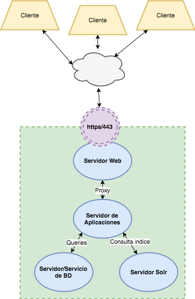

# cocrealabs-geonetwork

El proyecto cocrea-geonetwork tiene como objetivo la automatización del despliegue de la aplicación [Geonetwork](http://geonetwork-opensource.org/) en diferentes tipos de infraestructura destino. Hasta el momento, son soportadas una versión del despliegue para [AWS](https://aws.amazon.com/), una para [Vagrant/Virtualbox](https://www.vagrantup.com/docs/index.html), y OnPremise.

## Arquitectura

La arquitectura propuesta para el despliegue tiene en cuenta los siguientes componentes:

* __Servidor de aplicaciones__ - provee el "runtime" para ejecutar la aplicación Geonetwork

* __Servidor (o servicio en el caso de AWS) de bases de datos__ - a ser usada para persistencia de parte de la mayor parte datos funcionales de Geonetwork

* __Servidor solr__ - alberga solr, un software de indexamiento necesario para la funcionalidad de Geonetwork que permite el [analisis de datos WFS](http://geonetwork-opensource.org/manuals/3.0.5/eng/users/user-guide/analyzing/data.html#analyzing-data)

* __Servidor web__ - sirve como proxy a la infraestructura, exponiendo solo lo necesario para acceder a la aplicación a traves del navegador de manera "segura"

## Plataforma destino

Aunque mucho del codigo podria ser reutilizado para lograr un despliegue en gran parte de las distribuciones de Linux, el desarrollo ha sido enfocado y probado solo en maquinas destino __CentOS 7__ y __RedHat Enterprise Linux 7__.

## Tecnologías utilizadas

Las tecnologías utilizadas varian en su naturaleza y aplicación (servidor de aplicaciónes, frameworks, etc), algunas son direcamente la implementación de uno de los componentes detallados en la arquitectura de mas arriba (ej: Apache Tomcat -> Servidor de aplicaciónes) y otras son frameworks o herramientas de apoyo para la automatización y el despliegue de la infraestructura (ej: Ansible -> Automated Configuration Management). A continuación una lista de las tecnologías mas importantes:

* [Apache Tomcat](https://tomcat.apache.org/) - Servidor de aplicaciones
* [Apache Http Server](https://httpd.apache.org/) - Servidor Web
* [Solr](http://lucene.apache.org/solr/) - Software de indexamiento
* [MySQL](https://www.mysql.com/) - Base de datos
* [Ansible](https://www.ansible.com/) - Automated Configuration Management
* [Vagrant](https://www.vagrantup.com/intro/index.html) - Herramienta para la creacion de ambientes virtuales
* [Virtualbox](https://www.virtualbox.org/wiki/Downloads) - Software de virtualización

## Como empezar?
Dependiendo de las necesidades se puede hacer uso de una de las versiones del despliegue que han sido implementadas (AWS o Vagrant/Virtualbox). Se debe tener en cuenta que aunque en ambos casos el despliegue lucira como esta detallado arriba (con los diferentes componentes corriendo e interactuando entre sí) la version AWS ha sido implementada para lograr un ambiente de producción y la version basada en Vagrant para realizar pruebas del software o desarrollo.

### Local (Vagrant/Virtualbox)
Para ejecutar el despliegue local siga las instrucciones [aquí](doc/vagrant_provision.md)

### OnPremise
Para ejecutar el despliegue OnPremise siga las instrucciones [aquí](doc/onpremise_provision.md)

### AWS
Para la opción de despliegue en AWS, en esta documentación se presentan dos opciones: __"manual"__ o __"simple"__. La opción __"manual"__ esta orientada a usuarios con una experticia mayor en las tecnologías utilizadas y por lo general con deseos de realizar cambios no triviales a la configuración (via codigo). Por otro lado la opción __"simple"__ despliega la infraestructura con los valores sugeridos por defecto.

Si desea ejecutar la despliegue de manera __"manual"__ siga las instrucciones [aquí](doc/aws_provision_manual.md).

Si desea ejecutar la despliegue de manera __"simple"__ siga las instrucciones [aquí](doc/aws_provision_simple.md).
